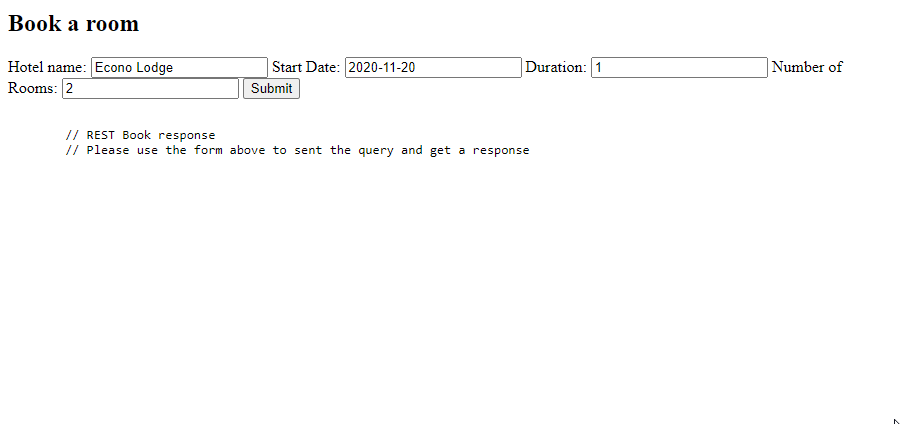

# ST2ISG-project

## Overview

### Solution diagram

### Features
- Persistent storage using YAML file as database (to be easely edited over-the-air by human not machines)
- Dockerized Dev container, using Docker or GitHub Codespaces
- Complex class structure for hotel and reservation instances
- Easy integration between Clients and Servers (in one hand REST and in the other hand SOAP)
- Deep debugging integration using Visual Studio Debbuging tools

## Installation

### Using VS Code and the Remote - Containers extension
> By using Microsoft Visual Studio Code and the Remote - Containers extension, you are able to code, test and build from the same and consitent platform. Indeed this Extension will load your project into a docker container. Settings and Dockerfile are available in the [`.devcontainer`](./devcontainer) folder.

> To play with this extension, you will need to have docker installed on your computer
Name: [Remote - Containers](https://marketplace.visualstudio.com/items?itemName=ms-vscode-remote.remote-containers)

1. Open the project using Visual Studio Code, you will have at the bottom-right corner a notification asking you to open this same project under a Dev container, click on the "Reopen in a container" button.

2. That's it, the dev container will be buit, all nodeJS dependancies will be installed, and as soon as the VSCode client became response you will be able to play launch servers and the rest web client !

### Using GitHub codespaces
> Develop from anywhere, anytime 

> Codespaces is currently in invite-only, please save your spot here: https://github.com/features/codespaces/signup

> The only thing you need is a web browser

#### Open the project in a GitHub Codespaces
Once you have openned the GitHub repository, you can create a codespaces instance by following this procedure :

1. Click on the green buttun "Download Code"

2. Then if you don't have any Codespace, use the "+ New Codespace" to launch a new instance

3. Wait for the Codespace to instanciate (it should takes only a couples of seconds)

4. You're all done, you can now start SOAP & REST servers and the REST Client (web rest client)

## Start servers (SOAP, REST) and the Web Client (GUI using a REST Client)
Now it's time to start servers and the web rest client.

> To do so, whether you are running this project in a container or using Codespaces the procedure is the same !

1. Open the "Run tab" on the left of VS Code (or use the `Ctrl` + `Shift` + `D` shortcut)

2. Then, at the top-left corner, select the desired server/client and click the green start button.

3. That's it !, you can check if servers and the rest client are running by checking the "Call stack" section (left panel on VS Code), You can use this section to pause, restart or stop any process.

## Open the REST Web client
It's now time to play with the WEB Gui, we have designed a special an minimalist rest web client to interract with our REST server.

> To do so, whether you are running this project in a container or using Codespaces the procedure is the same !

1. Open the "Remote Explorer" tab from the left pannel of VS Code.

2. Under the "PORTS" pannel search for the 8080 forwarding rule, and click on the "Open in Browser" icon

3. That's it ! You will be automatically redirected to your Codespace instance or directly to localhost (if you're running this project using the Remove Containers plugin)

## Play with the WEB REST Client
> You now have access to the Web REST Client, forms on this page, filter and booking will be sent using GET/POST methods to the REST server.
The REST server will the forward and translate (JSON to XML) your request to the SOAP server.

### Search for available hotels
> Using this web client, you can use the first form to search for available hotels depending a selected date, duration and the number of rooms required.

### Book a room in a hotel
> By using the second form, you can make a reservation and book room(s) at the desired hotel

### Check if the booked rooms are available
> Spoiler, they shouldn't be :)

### Check if we can make twice the same reservation
> Spoiler, we can't :)

## A quick overview of the REST server
> The REST server is responsible for handling Client request and forwardin them to the SOAP Server.

### Handling incoming request (GET/POST) from the REST Client
The REST server must be able to answer to the REST Client.
The REST client is making request using GET and POST method on 2 differents endpoints. This is the code responsible for the handling of the routes.

### Translating request and making SOAP request to the SOAP Server
Now that the REST Server has catch the REST Client request, it must translate it to a SOAP request.
To do so, we will create a SOAP Client and make the request, Here is a screeshot showing how we handle the request for the filter method using a soap client.

> We can see in this screenshot how the REST server is reaching the SOAP server, by giving the SOAP Client the wsdl, it is able to validate and make the request to the desired server using ports and operators.

Here is a sample request made using SOAP UI, a powerful software, SOAP and REST Client to play with SOAP and REST Servers

1. The request, written in xml

2. The endpoint of the SOAP Server, described in the wsdl

3. The response, also written in XML

### Handling the SOAP response
After the request is made, the SOAP server send us a response, the response is catch by the `callback` method in the rest server.
Here the callback is a function that sent the response to the `res` objet (it contain the response).

## Q&A

### Is the storage persistent?
> Yes, we are storing hotels and reservations both in-merory and in yaml files

### Are we using complex data types?
> Yes, both hotel and reservation are objets well defined using classes.

### How are you detecting if the project is running in GitHub Codespaces?
> It's actually really easy, We've found that if a container is running inside codespaces new environment variables are availables. If we detect the `CLOUDENV_ENVIRONMENT_ID` at the startup sequence of servers and the web rest client we update our code accordingly.

### how the REST Client is able to deted were it is running?
> We use the same procedure as previously mentionned. Since the REST Client is exposed on the default route (`/` and `GET` method) we've create and other route to expose the environment (`endpoint`). That way, when the client is loaded in the user navigator, it reach that endpoint and can sent request to the good REST server.
